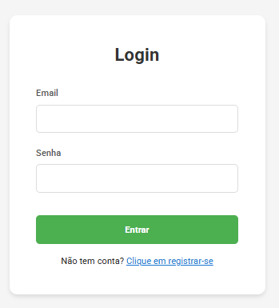
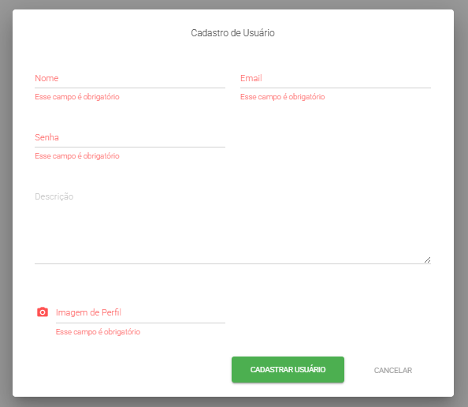
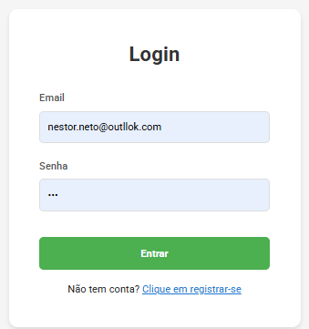
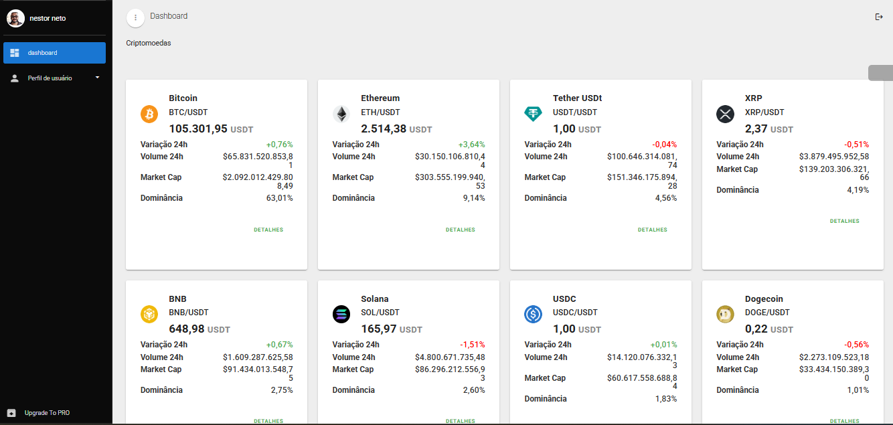
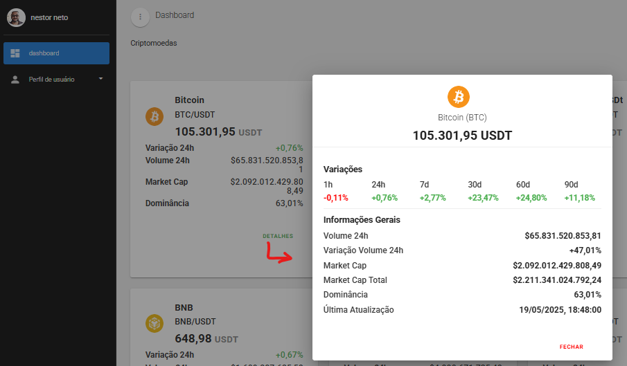
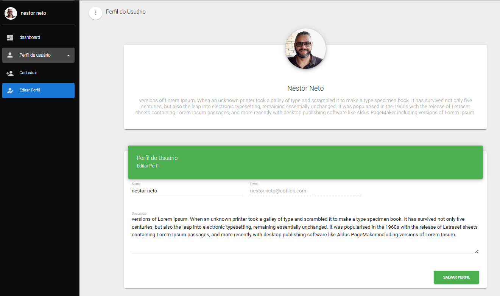
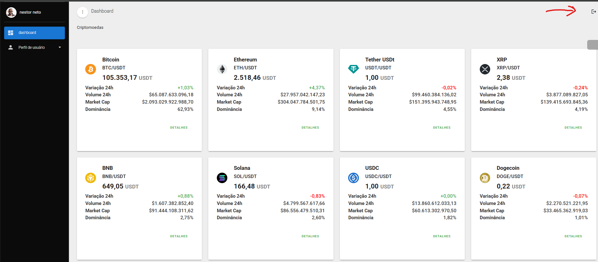

# Frontend Tech

Projeto frontend desenvolvido com Vue.js 2 + Vuetify, utilizando TypeScript e seguindo os princípios do Clean Code.

## 🔄 Integração com Backend

Este projeto frontend se integra com o BackEnd_Tech. Para que o frontend funcione corretamente, é necessário:

1. Clonar o repositório do backend:
```bash
git clone https://github.com/Nestor-Neto/BackEnd_Tech.git
```

2. Configurar e executar o backend localmente:
   - Siga as instruções de instalação no README do backend
   - Certifique-se que o backend está rodando na porta padrão (geralmente 3000)
   - O backend deve estar acessível em `http://localhost:3000`

> ⚠️ **Importante**: O frontend não funcionará corretamente sem o backend rodando localmente.

## 🚀 Tecnologias Principais

- Vue.js 2.6.11
- Vuetify 2.2.11
- Vuex 3.1.2
- Vue Router 3.1.3
- Vue I18n 8.15.3
- Axios 1.9.0

## 📋 Requisitos

- Node.js 16.x ou superior
- npm 7.x ou superior

## 🔧 Instalação

### Pré-requisitos
- Node.js 16.x ou superior
- npm 7.x ou superior
- Git instalado
- Backend rodando localmente (veja seção de Integração com Backend)

### Passo a Passo

1. **Clone o repositório**
```bash
git clone https://github.com/Nestor-Neto/FrontEnd_Tech.git
cd FrontEnd_Tech
```

2. **Instale as dependências**
```bash
npm install
```

3. **Configure as variáveis de ambiente**
   - Crie um arquivo `.env` na raiz do projeto
   - Adicione a URL do backend:
   ```
   VITE_API_URL=http://localhost:3000
   ```

4. **Inicie o servidor de desenvolvimento**
```bash
npm run dev
```

### Scripts Disponíveis

- `npm run dev` - Inicia o servidor de desenvolvimento
- `npm run serve` - Inicia o servidor sem abrir o navegador
- `npm run build` - Cria build de produção
- `npm run lint` - Executa o linter
- `npm run test:unit` - Executa testes unitários
- `npm run test:e2e` - Executa testes end-to-end

### Estrutura de Arquivos após Instalação
```
FrontEnd_Tech/
├── node_modules/     # Dependências instaladas
├── public/          # Arquivos públicos
├── src/             # Código fonte
├── tests/           # Testes
├── .env            # Variáveis de ambiente
├── package.json    # Configurações do projeto
└── README.md       # Documentação
```

### Solução de Problemas Comuns

1. **Erro de dependências**
   ```bash
   # Limpe o cache do npm
   npm cache clean --force
   
   # Remova node_modules e reinstale
   rm -rf node_modules
   npm install
   ```

2. **Erro de conexão com o backend**
   - Verifique se o backend está rodando
   - Confirme se a URL no arquivo `.env` está correta
   - Verifique se não há bloqueio de CORS

3. **Erro de compilação**
   - Verifique a versão do Node.js
   - Limpe o cache do Vue
   ```bash
   npm run clean
   ```

### Verificação da Instalação

Após a instalação, você pode verificar se tudo está funcionando corretamente:

1. O servidor de desenvolvimento deve iniciar sem erros
2. A aplicação deve abrir no navegador em `http://localhost:8080`
3. Você deve conseguir fazer login e acessar as funcionalidades
4. Os testes devem passar:
   ```bash
   npm run test:unit
   ```

## 🛠️ Scripts Disponíveis

- `npm run dev` - Inicia o servidor de desenvolvimento
- `npm run serve` - Inicia o servidor de desenvolvimento sem abrir o navegador
- `npm run build` - Cria uma build de produção
- `npm run lint` - Executa o linter

## 📁 Estrutura do Projeto

```
├── public/              # Arquivos públicos estáticos
├── src/
│   ├── assets/         # Recursos estáticos (imagens, fontes, etc)
│   ├── components/     # Componentes Vue reutilizáveis
│   ├── views/          # Componentes de página
│   ├── services/       # Serviços e integrações com API
│   ├── plugins/        # Plugins Vue
│   ├── locales/        # Arquivos de internacionalização
│   ├── sass/           # Estilos SASS
│   ├── router.js       # Configuração de rotas
│   ├── store.js        # Configuração do Vuex
│   └── i18n.js         # Configuração de internacionalização
├── tests/
│   ├── e2e/           # Testes end-to-end (Cypress)
│   └── unit/          # Testes unitários (Jest)
└── docs/              # Documentação do projeto
```

## 🏗️ Arquitetura e Padrões

### Arquitetura
- **MVVM (Model-View-ViewModel)**: Implementado através do Vue.js 2
- **Arquitetura Modular**: Organização em módulos independentes (components, views, services)
- **Gerenciamento de Estado**: Centralizado com Vuex para estado global
- **Plugin System**: Sistema de plugins para extensibilidade (Vuetify, Axios, Vee-Validate)

### Padrões de Design
- **Options API**: Utilizada para definição de componentes Vue
- **Single File Components**: Componentes Vue com template, script e estilos isolados
- **Service Layer**: Camada de serviços para comunicação com APIs
- **Plugin Pattern**: Extensibilidade através de plugins Vue
- **Observer Pattern**: Sistema de reatividade do Vue para atualizações de UI

### Estrutura de Diretórios
- **src/**: Código fonte principal
  - **assets/**: Recursos estáticos
  - **components/**: Componentes reutilizáveis
  - **views/**: Componentes de página
  - **services/**: Serviços e integrações
  - **plugins/**: Plugins Vue personalizados
  - **locales/**: Arquivos de internacionalização
  - **sass/**: Estilos globais

### Integrações
- **Vuetify**: Framework de UI Material Design
- **Vuex**: Gerenciamento de estado
- **Vue Router**: Roteamento
- **Axios**: Cliente HTTP
- **Vee-Validate**: Validação de formulários
- **Vue I18n**: Internacionalização

### Boas Práticas
- **Clean Code**: Código limpo e legível
- **DRY (Don't Repeat Yourself)**: Reutilização de componentes
- **Separação de Responsabilidades**: Divisão clara entre lógica e UI
- **Configuração Centralizada**: Configurações em arquivos dedicados

### Estratégias de Performance
- **Lazy Loading**: Carregamento sob demanda de rotas
- **Asset Optimization**: Otimização de recursos estáticos
- **Caching**: Implementado através do Vuex
- **Code Splitting**: Divisão do bundle em chunks

## ✨ Funcionalidades

- Sistema de autenticação com JWT
- Persistência de sessão
- Rotas protegidas
- Interface responsiva com Vuetify
- Gerenciamento de estado com Vuex
- Internacionalização (i18n)
- Validação de formulários com VeeValidate
- Testes unitários e end-to-end
- Linting e formatação de código

## 🧪 Testes

### Testes Unitários (Jest)
- **Configuração**: Jest com suporte a Vue.js
- **Cobertura**: Testes de componentes, serviços e utilitários
- **Estrutura**:
  ```
  tests/
  ├── unit/
  │   ├── components/    # Testes de componentes
  │   ├── services/     # Testes de serviços
  │   └── utils/        # Testes de utilitários
  └── setup.js          # Configuração global dos testes
  ```
- **Recursos**:
  - Snapshot testing para componentes
  - Mocks para serviços externos
  - Testes assíncronos
  - Matchers personalizados
  - Cobertura de código

### Testes E2E (Cypress)
- **Configuração**: Cypress com suporte a Vue.js
- **Cobertura**: Testes de fluxos completos e integração
- **Estrutura**:
  ```
  tests/
  ├── e2e/
  │   ├── integration/  # Testes de integração
  │   ├── plugins/      # Plugins do Cypress
  │   └── support/      # Configurações de suporte
  ```
- **Recursos**:
  - Testes de interface
  - Testes de API
  - Testes de autenticação
  - Testes de responsividade
  - Gravação de vídeos dos testes

### Scripts de Teste
```bash
# Executar testes unitários
npm run test:unit

# Executar testes unitários em modo watch
npm run test:unit -- --watch

# Executar testes E2E
npm run test:e2e

# Executar testes E2E em modo interativo
npm run test:e2e -- --open
```

### Boas Práticas
- **Testes Isolados**: Cada teste deve ser independente
- **Clean Tests**: Código de teste limpo e legível
- **Testes Determinísticos**: Resultados consistentes
- **Cobertura Adequada**: Foco em casos críticos
- **Testes Rápidos**: Otimização do tempo de execução

### Integração Contínua
- Execução automática de testes em cada PR
- Relatórios de cobertura
- Verificação de qualidade do código
- Pipeline de testes automatizado

## 📝 Convenções de Código

- ESLint para linting
- EditorConfig para configurações do editor
- Babel para transpilação
- SASS para estilos

## 🔐 Segurança

- Variáveis de ambiente para configurações sensíveis
- Autenticação JWT
- Proteção de rotas
- Validação de dados


## 📄TELAS

> ⚠️ **Importante**: Para o primeiro acesso, clique em registrar-se.

<p align="center">
  
</p>
<p align="center">
  
</p>
<p align="center">
  
</p>
<p align="center">
  
</p>
<p align="center">
  
</p>
<p align="center">
  
</p>
<p align="center">
  
</p>
<p align="center">
  
</p>

## 🌐 Internacionalização

Suporte a múltiplos idiomas através do Vue I18n, com arquivos de tradução organizados no diretório `locales/`.

## 📄 Licença

Este projeto está sob a licença MIT.
